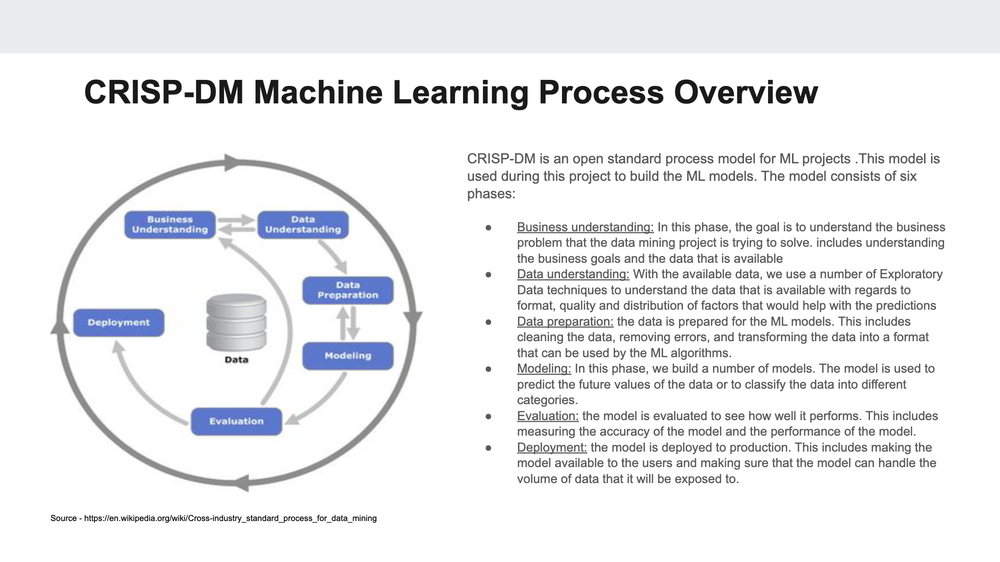

# NBA players 2023 season scored points prediction

## Elevator speech

Predicting basketball points for each player is crucial in basketball analytics. It is a key performance metric that helps coaches, analysts, and fans evaluate a player’s scoring ability and overall offensive contribution to the team. Understanding a player’s scoring potential aids in strategic decision-making during games, player selection, and talent scouting. This notebook delves into basketball data analytics and uses various machine learning techniques to predict players’ point contributions.

The main objective is to demonstrate the implementation of four different regression models to predict basketball points: Linear Regression, K-Nearest Neighbors (KNN) Regressor, Decision Tree Regressor (DT), and Random Forest Regressor (RFR). Each model is used to predict players’ total points based on various performance metrics, such as minutes played, field goals made, free throws made, assists, steals, blocks, and other relevant statistics.

By employing these regression models, we aim to understand their performance in predicting basketball points and compare their predictive capabilities. This analysis will provide valuable insights into the strengths and weaknesses of each model and help identify the most suitable one for predicting basketball points in this specific dataset.

Let’s explore the world of basketball data analytics and examine the predictions made by each of the four regression models, offering a comprehensive assessment of their effectiveness in forecasting player scoring contributions.

## Planning

- Dataset overview: Explore the basketball dataset and understand its structure and features.
- Import libraries: Import the necessary libraries for data manipulation and visualization.
- Read dataset and get information from data: Load the dataset and gather initial insights.
- Data visualization: Visualize the data to gain a better understanding of its distribution and relationships.
- Features: Select the relevant features for predicting basketball points.

**Modeling**:
* Linear Regression: Implement Linear Regression to predict basketball points.
* KNeighbors Regressor: Utilize KNN Regressor for point prediction.
* Decision Tree Regressor: Implement DT Regressor for point prediction.
* Random Forest Regressor: Utilize RFR for point prediction.

**Predictions visualization**: Visualize the predictions made by each regression model and evaluate their performance.

**Data Sources**
The following datasets will be used for this project:

NBA player stats [https://www.kaggle.com/datasets/arashnic/fitbit](https://www.kaggle.com/datasets/vivovinco/20222023-nba-player-stats-regular)

